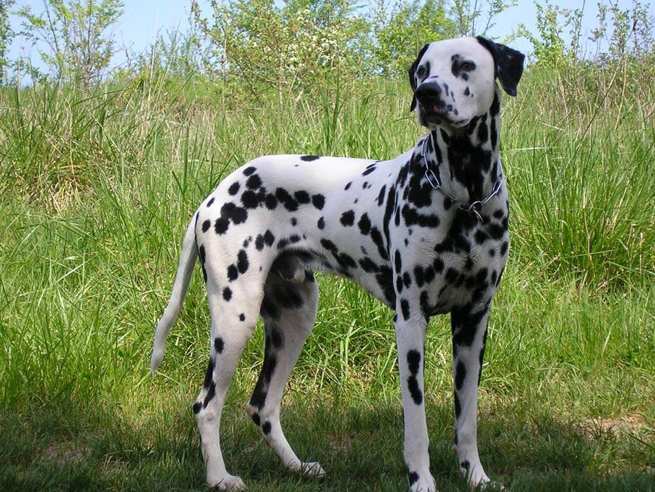
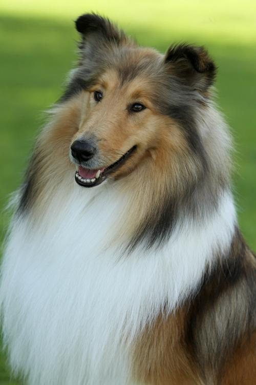
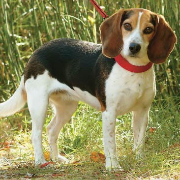

<h1>:dog: Dog breed classifier service</h1>

<p float="left">
  
   
  
</p>

With CNN pertained models the service defines whether the image is a dog and what breed of this dog.

For every submitted image the service can tell:
- whether the image is an image of a dog or not
- if it is a dog image then what breed of a dog it is.

<h2>:robot: How does it work</h2>

For a classification task the service uses a set of pretrained [CNN models](https://en.wikipedia.org/wiki/Convolutional_neural_network). 
First it extracts the pet image label from the filename before classifying the images using a pretrained CNN model. Then it predicts a breed based on submitted image.
The service provides a comparison of the performance of 3 different CNN model architectures to determine which provides the 'best' classification. Short summary statistics for the comparison can be found in `output/` folder.

<h2>:rocket: How to run the service</h2>

1. Set up environment

```
pip install virtualenv          (if you don't already have virtualenv installed)
virtualenv venv                 (to create your new environment (called 'venv' here))
source venv/bin/activate        (to enter the virtual environment)
pip install -r requirements.txt (to install the requirements in the current environment)
```

2. Call from terminal

```
python3 check_images.py --dir pet_images/ --arch vgg --dogfile dognames.txt
```
- Folder that contains the pet images --dir
        'pet_images/'
        'uploaded_images/'
- The CNN model architecture to use --arch
        'resnet', 
        'alexnet', 
        'vgg'
- The file that contains the list of valid dognames --dogfile
        'dognames.txt'

3. Batch run for all models at once

```
sh run_models_batch.sh
```
check the generated files with statistics per CNN model architecture in the `output/` folder.

<h2> :cat: Classify your own image</h2>

1. Upload your images to the `uploaded_images/` folder, then run the `sh run_models_batch_uploaded.sh` to classify those images.

Your images have to follow the **image requirements**:
   * Images are in jpeg format with extension `.jpg`
   * Images are approximately square in shape (their height and width are approximately the same numbers of pixels).
   * The name convention is an *object_number.jpg*. This name is formatted such that if more than one word makes up the animal name those words are separated by an unscore `_` (e.g. `Dog_01.jpg`, `Animal_Name_25.jpg`, `Black_bear_01.jpg`, `Coffee_mug_01.jpg`)
You can upload imegae of dogs, animals and even objects - the service tells you if it is not a dog on the image.

2. Run three different classifier and look up the results in the `output/` folder.

Manually from terminal:
```
python check_images.py --dir uploaded_images/ --arch resnet  --dogfile dognames.txt > output/resnet_uploaded-images.txt
python check_images.py --dir uploaded_images/ --arch alexnet --dogfile dognames.txt > output/alexnet_uploaded-images.txt
python check_images.py --dir uploaded_images/ --arch vgg  --dogfile dognames.txt > output/vgg_uploaded-images.txt
```

Automated via bash script:
```
sh run_models_batch_uploaded.sh
```

